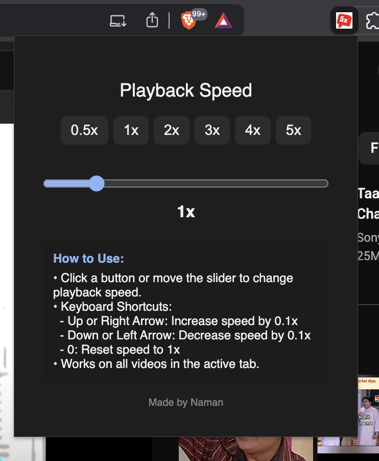

# YouTube 5x

A simple Chrome extension that allows you to control YouTube video playback speed from **0.5x** up to **5x**.

---

## Features

- Playback speed control ranging from 0.5x to 5x  
- Clean and minimal UI  
- Keyboard shortcuts for quick speed adjustment  
- Manual setup via Chrome Developer Tools (no store submission needed)  
- Self-made, lightweight, and easy to use  

---

## How to Install

1. Clone or download this repository to your local machine.
```bash
git clone https://github.com/Naman-Tulsyan/youtube5x.git
```
2. Open Chrome and navigate to `chrome://extensions/`
3. Enable **Developer mode** (toggle in the top right corner).
4. Click on **Load unpacked** and select the extension folder.
5. You should now see the extension active in your browser.

---

## Usage

- Open YouTube and play any video.
- Use the extension UI to select playback speed between 0.5x and 5x.
- Use keyboard shortcuts (defined inside the extension) to quickly adjust speed.

---

## Keyboard Controls

- Up or Right Arrow: Increase speed by 0.1x
- Down or Left Arrow: Decrease speed by 0.1x
- 0: Reset speed to 1x
---

## Screenshot



---

## Contribution

This extension is self-made. Feel free to open issues or create pull requests if you want to improve it!

